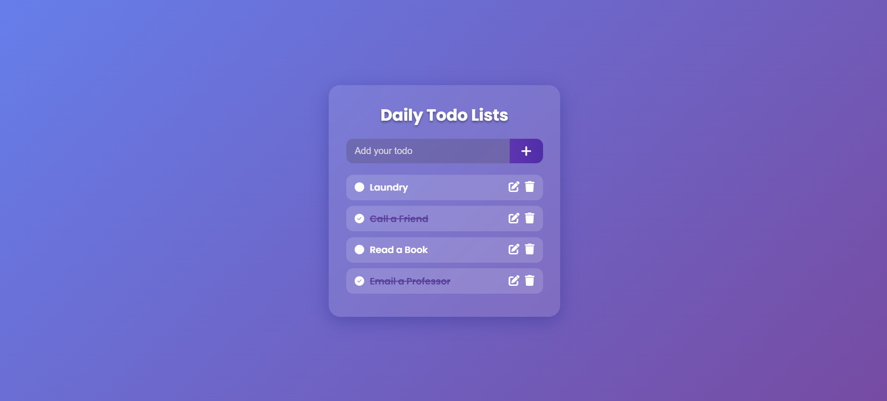

#  Daily Todo List App

This is a full-stack **Todo List** application built with **Golang (Go)** for the backend and **Vue.js** for the frontend.

The app allows users to:
- Create new todos
- Mark todos as complete/incomplete (with strikeout effect)
- Edit existing todos
- Delete todos with a confirmation modal

---

##  Technologies Used

| Frontend | Backend | Database |
|:--------:|:-------:|:--------:|
| HTML, CSS, JavaScript (Vue.js 2.x) | Golang (Go) | MongoDB |

---

##  Project Structure

```
Golang-Todo/
├── static/
│   └── home.tpl        # Frontend HTML + Vue.js app
├── main.go              # Go server file (handles API routes)
├── go.mod               # Go module definition
├── go.sum               # Go dependencies lock file
└── README.md            # Project documentation (this file)
```

---

##  How to Run Locally

### 1. Clone the repository
```bash
git clone <your-repo-url>
cd Golang-Todo
```

### 2. Install Go dependencies
```bash
go mod tidy
```

### 3. Start your MongoDB server
Make sure MongoDB is running locally at `localhost:27017`.  
The app uses:
- **Database**: `demo_todo`
- **Collection**: `todo`

You can start MongoDB using:
```bash
mongod
```

> _(If you don’t have MongoDB installed, install it first.)_

### 4. Run the Go server
```bash
go run main.go
```

You should see:
```
Listening on port :9000
```

### 5. Open the application
Visit this URL in your browser:
```
http://localhost:9000/
```

 Done! You can now add, edit, complete, and delete your todos.

---

##  API Endpoints (Handled by Go Backend)

| Method | Endpoint         | Description                     |
|:------:|:-----------------:|:--------------------------------:|
| `GET`  | `/todo/`          | Fetch all todos                 |
| `POST` | `/todo/`          | Create a new todo               |
| `PUT`  | `/todo/{id}`      | Update a todo (title/status)    |
| `DELETE` | `/todo/{id}`    | Delete a todo                   |

---

##  Features

-  **Add Todos** instantly
-  **Edit Todos** with no page refresh
-  **Mark as Complete** with strike-through effect
-  **Delete Todos** through a modern confirmation modal
-  **Beautiful UI** (glassmorphism + animations)
-  **Fully Responsive** design (works on mobile & desktop)

---

##  Future Enhancements

- Add due dates and reminder notifications
- Drag & drop reordering of todos
- Filter by Completed / Pending
- Light/Dark theme toggle
- Deploy to cloud (like Render / Vercel)

---

##  Things to Note

- **Backend** is completely written in **Golang** (Go) using **Chi Router** and **mgo** (MongoDB driver).
- **Frontend** uses **Vue.js 2** with **Vue Resource** for HTTP requests.
- **No backend code is written in frontend files** — clean separation.
- **Smooth UI/UX** powered by modern CSS.

---

##  Screenshots



##  Questions?

Feel free to connect if you have any questions!  
Happy building 


